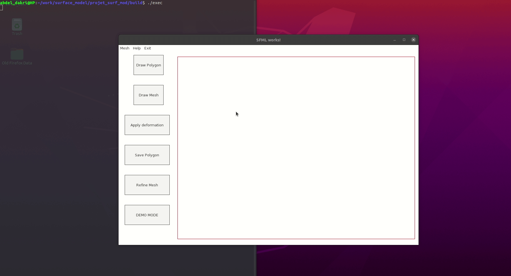

# Surface modeling project: Laplacian mesh editing - ARAP deformation 

Dakri Abdelmouttaleb, Arthur Vivière

## Short description

This project is an implementation of an application that uses the techniques in both [Implementing As-Rigid-As-Possible Shape Manipulation and Surface Flattening](https://www-ui.is.s.u-tokyo.ac.jp/~takeo/papers/takeo_jgt09_arapFlattening.pdf) and [As-Rigid-As-Possible Shape Manipulation](https://www-ui.is.s.u-tokyo.ac.jp/~takeo/papers/rigid.pdf) papers. The project implements an interactive GUI for polyline drawing and triangulation (using an earclip algorithm), as well as as rigid as possible deformation with some extensions.

This project is entirely coded in C++ and uses the following librairies:

* [SFML 2.5](https://www.sfml-dev.org/) : For the graphics and IO interaction.

* [TGUI 0.9](https://tgui.eu/) : For the widgets and GUI.

* [Eigen 3.4](https://eigen.tuxfamily.org/index.php?title=Main_Page) : For the linear algebra.

* [Cmake](https://cmake.org/) : For the packaging, build and compilation .


## How to get it up and running ?

Eigen is a header-only librairy, it can be downloaded and put inside **external_libs/**. 


### Installing the librairies through the package manager

The use of **CMakeLists_package** is recommended (by changing its name to CMakeLists.txt) if this is the case.

```shell
sudo apt-get install libsfml-dev
```

You can install tgui by adding the PPA to your system and install the “libtgui-0.9-dev” package:

```shell
sudo add-apt-repository ppa:texus/tgui
sudo apt-get update
sudo apt-get install libtgui-0.9-dev
```

### Compiling the librairies

Or using the Precompiled SFML librairy for ubuntu. The use of **CmakeLists.txt** is recommended, the librairies should be built and compiled inside  **external_libs/**.

:warning: for the extensions, switch to the **nouvelle** branch rather than the **new-master** default dev branch. Some work should be done soon to integrate the extension into the master branch (a simple merge is not very simple unfortunatly).

## Presentation of the software and the results

For a more technical reading of the papers and the actual C++ source code, plese refer to the project report [MMIS 3A Surface modelling course : Grenoble-INP ENSIMAG](https://www.overleaf.com/read/qtjhrcfhmjfw). We will content ourself with the video demo below : 



:warning: The choppy nature of the footage is due to the gif capturing software, you can try the app for yourself to be sure.
 

